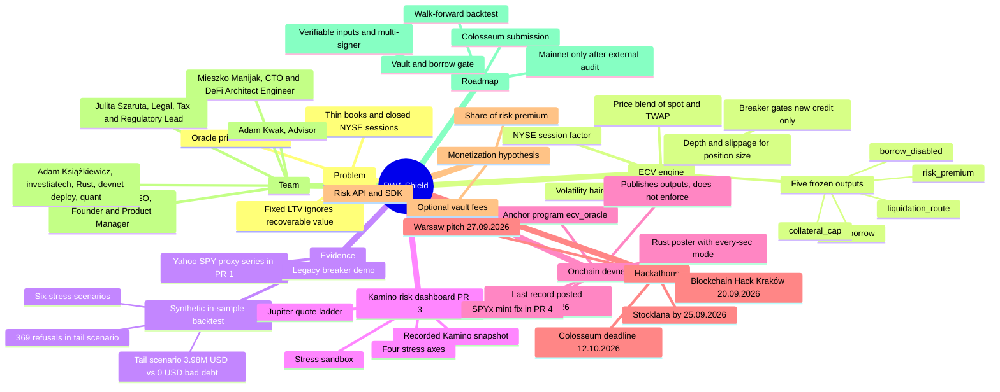

# RWA Shield — Project Mind Map

A one-page map of the project: problem, ECV engine, evidence, dashboard, devnet program, hackathons, monetization hypothesis, team and roadmap. Details and sources are in [WHITEPAPER.md](WHITEPAPER.md) and [ROADMAP.md](ROADMAP.md). All backtest figures are synthetic and in-sample; the on-chain program runs on Solana devnet.

Notes:
- Node text avoids brackets, parentheses and colons so the Mermaid parser stays simple.
- "Mainnet only after external audit" is an undated long-term goal, not the current status.
